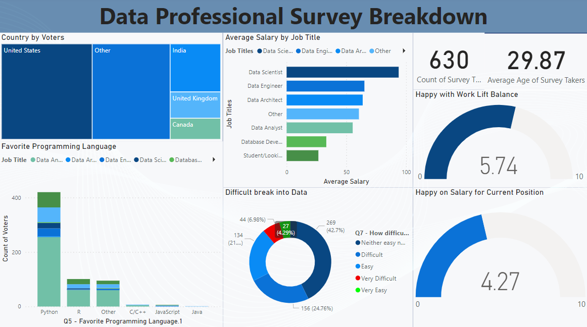

# Data-Professional-Survey-Breakdown

## Table of contents 

- [Objective](#objective)
- [Data Source](#data-source)
- [Stages](#stages)
- [Design](#design)
  - [Dashboard](#dashboard)
  - [Tools](#tools)
- [Development](#development)
  - [Pseudocode](#pseudocode)
- [Visualization](#visualization)
  - [Results](#results)
- [Analysis](#analysis)
  - [Findings](#findings)
 

# Objective 

What is the key pain point? 

The Campaign head wants to find out key point by data expert and ask few questions which are below.

Q1 - Which Title Best Fits your Current Role?

Q2 - Did you switch careers into Data?

Q3 - How Happy are you in your Current Position with the following?
- Work/Life Balance
- Coworkers 
- Management
- Upward Mobility)
- Learning New Things

Q4 - How difficult was it for you to break into Data?

This will help the team to make informed decisions about people which region are more successfull in data related feild.

## Data source 

- What data is needed to achieve our objective?

We need data on the Data Professional Survey Breakdown that includes their 
- country of person submit the survey form
- Favorite Programming Language
- How Happy are you in your Current Position with the different aspect

- Where is the data coming from?, [see here to find it.](https://github.com/Syed-Ammad-99/Data-Professional-Survey-Breakdown/blob/main/data%20file.xlsx)

## Stages

- Design
- Developement
- Analysis
- Insigh 
 

## Design 

### Dashboard components required 
- What should the dashboard contain based on the requirements provided?

To understand what it should contain, we need to figure out what questions we need the dashboard to answer:

1. What is the favorite programming among the voters?
2. Which job title have the highest avg salary?
3. How difficult to break into data?
4. Rate work/Life balance in current environment?

For now, these are some of the questions we need to answer, this may change as we progress down our analysis. 

### Dashboard

- What should it look like? 

Some of the data visuals that may be appropriate in answering our questions include:

1. Treemap
2. Stacked bar chart
3. Stacked column chart
4. Scorecards
5. Donut chart 

### Tools 

| Tool | Purpose |
| --- | --- |
| Excel | Exploring the data |
| Power BI | Visualizing the data via interactive dashboards |
| GitHub | Hosting the project documentation and version control |

## Development

### Pseudocode

- What's the general approach in creating this solution from start to finish?

1. Get the data
2. Explore the data in Excel
3. Visualize the data in Power BI
4. Generate the findings based on the insights

# Visualization 

## Results

- What does the dashboard look like?

This shows the Data Professional Survey Breakdown do far. 

# Analysis 

## Findings

- What did we find?

For this analysis, we're going to focus on the questions below to get the information we need for our survey - 

Q1 - What is the favorite programming among the voters?

Q2 - Did you switch careers into Data?

Q3 - Which job title have the highest avg salary?

Q4 - How Happy are you in your Current Position with the following?
- Work/Life Balance
- Salary
  
### 1. What is the favorite programming among the voters?

| Rank | Favorite programming | Votes  |
|------|----------------------|------- |
| 1    | Python               | 420.00 |
| 2    | R                    | 101.00 |
| 3    | Other                | 95.00  |
| 4    | C/C++                | 7.00   |
| 5    | JavaScript           | 6.00   |
| 6    | Java                 | 1.00   |

Note: Out of 420 votes 255 are data analyst who love programming with python.

### 2. Did you switch careers into Data?

| Rank | Job Title      | Votes |
|------|--------------- |-------|
| 1    | Data Analyst   | 246.00|
| 2    | Student        | 55.00 |
| 3    | Other          | 33.00 |
| 4    | Data Engineer  | 22.00 |
| 5    | Data Scientist | 19.00 |
| 6    | Database Developer | 5.00 |
| 7    | Data Architect | 2.00 |

### 3. Which job title have the highest avg salary?

Data Scientist have the highest avg salary per year of 93.78k.

### 4. How Happy are you in your Current Position with the following?
- Voters satisfactory score on Work/Life Balance 5.74 out of 10.
- Voters satisfactory score on salary 4.27 out of 10.
